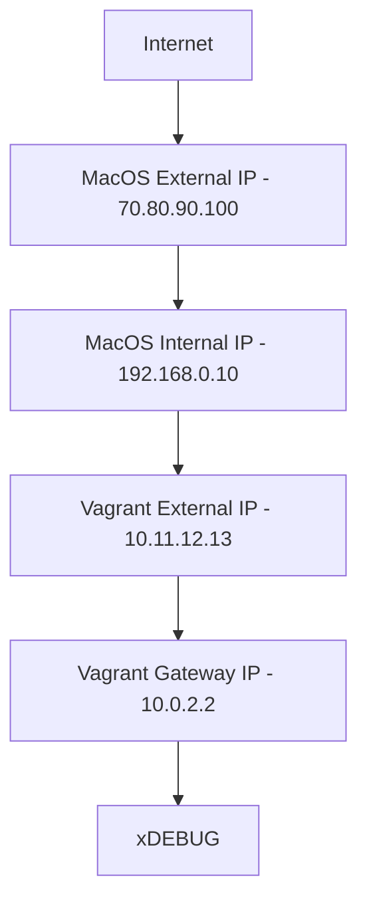

# Module Installs

Make sure you install into directory:

```
puppet module install puppetlabs-apache --target-dir /Users/andrewpearson/Storage/Code/Puppet/modules 
```

Always do a `sudo` to install into the correct puppet directory location.
```
sudo puppet module list
```

## Networking



Find the gateway address with `ip r` or `netstat -nr -f inet`


